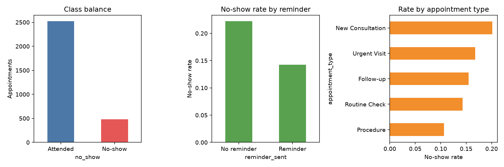
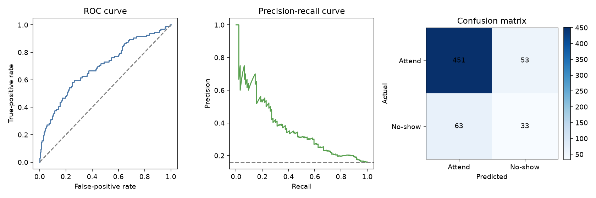
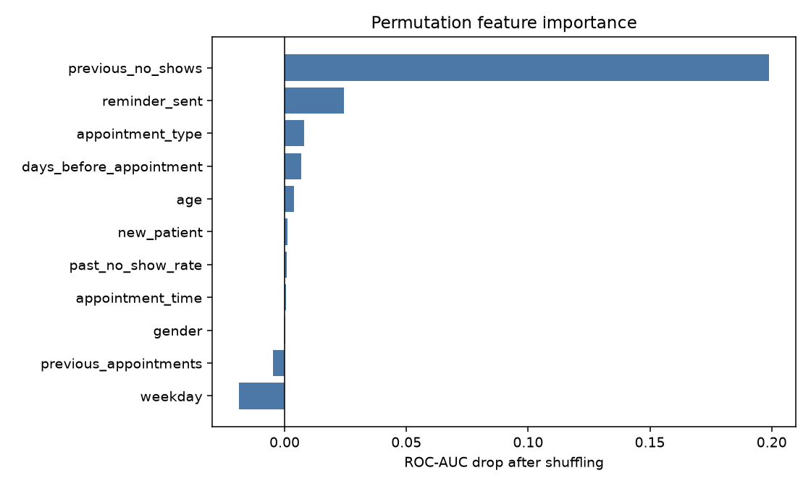

# Part 2 — No-show prediction results

All numbers below come from the uploaded `CliniKit_NoShow_Dataset.csv`, not generated data.

## 1. Basic data exploration

- Rows: **3,000**
- Source columns: **12** (10 candidate predictors, one ID, and target `no_show`)
- No-shows: **478 (15.9%)**
- Attended: **2522 (84.1%)**
- Missing cells: **0**
- Duplicate rows / IDs: **0 / 0**

Observed no-show rate by reminder:
- no reminder: **22.2%** (639 rows)
- reminder sent: **14.2%** (2361 rows)

Observed rate by appointment type:
- New Consultation: **20.1%** (715 rows)
- Urgent Visit: **16.8%** (280 rows)
- Follow-up: **15.5%** (1118 rows)
- Routine Check: **14.3%** (539 rows)
- Procedure: **10.6%** (348 rows)

These are associations in this dataset. They do not prove, for example, that sending a reminder caused the lower no-show rate.

## 2. Data preparation

- Removed `appointment_id` from the inputs because it identifies a row rather than describing appointment risk.
- Kept `weekday`, `appointment_time`, `gender`, and `appointment_type` as categories and one-hot encoded them.
- Kept numeric values numeric and standardised them for logistic regression.
- Added `past_no_show_rate = previous_no_shows / previous_appointments`; new patients receive zero because they have no history.
- Used a stratified 80/20 split, so train and test contain the same share of no-shows.
- Kept the 600 test rows hidden during model and threshold selection.

## 3. Model selection

Five-fold cross-validation was run on the training set only:

| model | CV ROC-AUC | CV PR-AUC | CV balanced accuracy |
|---|---:|---:|---:|
| `logistic_regression` | 0.694 ± 0.033 | 0.368 | 0.546 |
| `random_forest` | 0.672 ± 0.022 | 0.333 | 0.658 |
| `hist_gradient_boosting` | 0.648 ± 0.019 | 0.294 | 0.624 |
| `dummy_baseline` | 0.500 ± 0.000 | 0.159 | 0.500 |

Selected: **`logistic_regression`**, because it had the strongest cross-validated ROC-AUC. Logistic regression is also the simplest candidate to explain: it combines weighted evidence from each input into one probability.

Balanced accuracy in the table uses each candidate's default 0.5 cut-off. It was not the selection score because the final operating cut-off is tuned separately. Logistic regression also led on PR-AUC.

## 4. Held-out test results

- ROC-AUC: **0.695**
- PR-AUC (average precision): **0.372** (random baseline is the 16.0% no-show rate)
- No-show precision: **0.384**
- No-show recall: **0.344**
- No-show F1: **0.363**
- Balanced accuracy: **0.619**
- Ordinary accuracy: **0.807** (always predicting attendance would score 0.840, but catch zero no-shows)
- Brier score: **0.121** (lower means better probability estimates)
- Decision threshold: **0.263**, chosen by maximum no-show F1 using out-of-fold training predictions—not the test set

Confusion matrix: **TN=451, FP=53, FN=63, TP=33**.

In plain English: the model caught **33 of 96** true no-shows and incorrectly flagged **53** patients who attended.

## 5. Strongest influences

Permutation importance shuffles one raw input at a time. A larger ROC-AUC drop means the model relied on that input more:

- `previous_no_shows`: **0.1990** AUC drop
- `reminder_sent`: **0.0243** AUC drop
- `appointment_type`: **0.0082** AUC drop
- `days_before_appointment`: **0.0069** AUC drop
- `age`: **0.0038** AUC drop
- `new_patient`: **0.0013** AUC drop
- `past_no_show_rate`: **0.0008** AUC drop
- `appointment_time`: **0.0006** AUC drop
- `gender`: **0.0002** AUC drop
- `previous_appointments`: **-0.0046** AUC drop
- `weekday`: **-0.0188** AUC drop

A small negative value means shuffling that column slightly improved this test score; treat it as noise or an unhelpful feature, not negative importance.

Important: influence is not cause. This model finds patterns; it cannot prove why a patient missed an appointment.

## 6. Why these metrics

- **Accuracy alone is misleading:** 84% attended, so an always-attend model already gets about 84% accuracy while helping nobody.
- **Recall:** of all patients who missed, how many were flagged?
- **Precision:** of all patients flagged, how many actually missed?
- **PR-AUC:** summarises the precision/recall trade-off and is useful for the rare no-show class.
- **ROC-AUC:** tests whether true no-shows generally receive higher risk scores than attendances, independent of one threshold.

## 7. Example predictions

These patients are fictional. They demonstrate the saved pipeline; they are not extra evaluation rows:
- **6.0%** (do not flag) — Returning patient, reminder sent, no earlier misses
- **38.1%** (flag) — New consultation, booked well ahead, no reminder
- **84.6%** (flag) — Returning patient with several earlier misses, no reminder

Reproduce them with `.venv/bin/python ml/predict.py` after training.

## 8. Product integration

A nightly job would score tomorrow's appointments. Reception could see a risk flag and decide whether to send an extra reminder or offer a waitlist slot. The model advises; it must not cancel, overbook, or deny care automatically.

In production I would also monitor accuracy and calibration over time, audit performance across patient groups, retrain on newer outcomes, and choose the threshold with the clinic based on the cost of missed visits versus unnecessary reminders.

## 9. Limits

- Only 3,000 rows and 478 no-shows are available.
- There is no patient identifier, so repeat visits by one person cannot be kept in the same train/test group.
- The result is moderate, not production-ready.
- Observed associations—especially reminders—must not be described as causal.
